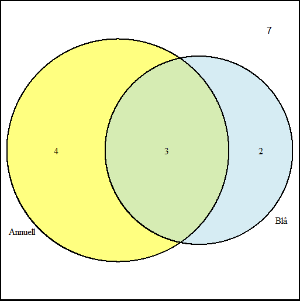

# Om statistik

## Skeende och brus

$\text{Observation} = \text{Fenomen} + \text{Brus}$

Statistik är vetenskapen om bruset

<div style="position:relative;height:300px;">
<p style="position:absolute;left:0%;width:33%">

</p>

<p style="position:absolute;left:33%;width:33%">

</p>

<p style="position:absolute;left:66%;width:33%">

</p>
</div>

## Populationsbegreppet

<div style="position:absolute;left:0%;width:50%;text-align:center;vertical-align:middle;">
Ekologisk population


Fysiska individer
</div>

<div style="position:absolute;left:50%;width:50%">
Statistisk population


Variabelvärden
</div>

## Stickprov

<div style="position:absolute;left:0%;width:50%">
Ett stickprov är ett urval ur populationen
</div>

<div style="position:absolute;left:50%;width:50%">

</div>

## 

<h3>Slumpmässigt urval</h3>

Alla individer i population har **någon** sannolikhet att tas med i stickprovet

<h3>Obundet slumpmässigt urval</h3>

Alla individer i population har **samma** sannolikhet att tas med i stickprovet

## Experiment

Styr en *ingångsvariabel* och mäter utfallet i en *responsvariabel*

Exempel

- Växthusförsök med skilda genotyper
- Populationssammansättning med eller utan bränning föregående år

## Replikat och pseudoreplikat

$$\text{Observation} = \text{Fenomen} + \text{Brus}$$

*Fenomenet* är detsamma över replikaten, men *bruset* varierar

Upprepade försök (replikat) ger en klarare bild av fenomenet

*Pseudoreplikat* - upprepade mätningar på samma enhet

## Randomisering

Behandlingar och observerade enheter

Randomisering: behandling paras med observerad enhet slumpmässigt

# Beskrivande statistik

## Statistisk variabel

En mätbar egenskap som varierar mellan individer

## Taxologi för variabler

<div style="position:absolute;left:0%;width:45%">
*Kvalitativa* variabler kan ej beskrivas med siffror

*Kvantitativa* variabler beskrivs med siffror

Kvantitativa variabler kan vara *diskreta* eller *kontinuerliga*
</div>

<div style="position:absolute;left:50%;width:50%">

</div>

## Taxologi för variabler, skaltyper

Variabler kan även kategoriseras i *skaltyper*

Skaltyp baseras på relation mellan utfall

## Nominalskala

Ingen relation mellan möjliga utfall

Art, egennamn, nationalitet, yrke, jordtyp

## Ordinalskala

Ett utfall kan vara mindre än, mer än eller lika ett annat utfall

Inget mått på hur stor skillnaden är

Subjektiva kvalitetsbedömningar

## Intervall-kvot-skala

Skillnaden mellan två utfall är tolkningsbar

Kvotskalan har en fixerad nollpunkt, medan variabler på intervallskala kan vara negativa

Temperatur (celsius och kelvin), beräknade antal, vikter, höjder, längder

## Sammanfattning, taxologi

<div style="position:absolute;left:0%;width:45%;font-size:0.75em;">
- En myras vikt
- En films betyg
- En sommardags temperatur
- En människas nationalitet
- En hotellgästs nöjdhet
- En fågels art
</div>

<div style="position:absolute;left:50%;width:50%;font-size:0.75em;">
>- Kvant, kontinuerlig, intervall/kvot
>- Kvalitativ, ordinal
>- Kvant, kontinuerlig, intervall/kvot
>- Kvalitativ, nominal
>- Kvalitativ, ordinal
>- Kvalitativ, nominal
</div>

# Punktskattningar

## Läge och spridning

En punktskattning är ett tal som beskriver någon egenskap hos en variabel

*Lägesmått* skattar var på tallinjen variabeln är centrerad

*Spridningsmått* skattar hur utspridd variabeln är

## Medelvärde

Summan av alla värden delat på antalet värden

$$\bar x = \frac{1}{n} \sum_{i=1}^n x_i$$

Ett jämviktsläge

## Median

Lika många värden över medianen som under medianen

Betecknas här *Md*

## Kvartiler

Kvartiler ($q_1, q_2, q_3)$ delar ett material i fyra lika delar

En fjärdedel ligger under $q_1$, två fjärdedelar under $q_2$ och tre fjärdedelar under $q_3$

$q_2 = Md$

## Typvärde

Det vanligast förekommande värdet

## Ett exempel

Antal sparvnävor i stickprov från åtta fält

$$(2, 4, 6, 6, 11, 13, 16, 22)$$

<div style="position:absolute;left:0%;width:45%;">
- Medelvärde
- Median
- Typvärde
</div>

<div style="position:absolute;left:50%;width:50%;">
>- $10$
>- $8.5$
>- $6$
</div>

## Varians, $s^2$

Summerade kvadratavstånd till medelvärdet delat på $n - 1$

$$s^2 = \frac{\sum_{i=1}^n (x_i - \bar x)^2}{n - 1}$$

## Standardavvikelse, $s$

Standardavvikelsen $s$ är roten av variansen

$$s = \sqrt s$$

$s$ är på samma skala som den ursprungliga variabeln

## Kvartilavstånd

*Interquartile range, IQR*

Avståndet mellan $q_1$ och $q_3$

$$IQR = q_3 - q_1$$

# Visualiseringar

## Stapeldiagram

Staplar ger antalet observationer inom en viss kategori

```{r, echo = F, fig.height=4, fig.align='center'}
dat <- data.frame(Art = c("Mjuknäva", "Skatnäva", "Skuggnäva", "Sparvnäva"),
                  Antal = c(8, 12, 4, 9),
                  SE = c(0.4, 0.3, 0.9, 1.2))

library(ggplot2)
ggplot(dat, aes(Art, Antal, ymin = Antal - SE, ymax = Antal + SE)) +
  geom_bar(stat = "identity", col = "black", fill = "lightblue", width = 0.3) + 
  geom_errorbar(width = 0.1) + theme_bw() + ylim(0, 14) +
  labs(title = "Antal observationer per art",
       caption = "Felstaplar anger +/- ett medelfel.")
```


## Cirkeldiagram

<div style="position:absolute;left:0%;width:45%;">
Sektorer i en cirkel ger andelen observationer inom en viss kategori

Det finns människor som är väldigt negativt inställda till cirkeldiagram
</div>

<div style="position:absolute;left:50%;width:50%;">
```{r, echo = F, fig.height=7, fig.align='center'}
pie(dat$Antal, paste(dat$Art, round(dat$Antal/sum(dat$Antal) * 100, 1), "%"), 
    main="Andel observationer per art")
```
</div>


## Lådogram (boxplot)

<div style="font-size:0.75em;">
Visar minimum och maximum, kvantiler och eventuella extremvärden

Den inre boxen går från $q_1$ till $q_3$, 

*Morrhår* går till minsta respektive högsta värde som inte är extremvärden

Extremvärden (bortom ett och ett halvt IQR från närmsta kvartil) markeras med punkter
</div>

```{r, echo = F, fig.height=2, fig.align='center'}
set.seed(190806)
a <- c(rnorm(100), 7) + 10 
a <- data.frame(values = a)

b <- quantile(a$values)

#IQR(a$values)

qs <- data.frame(nam = c("Min", "Q1", "Q2", "Q3", "Q3 + 1.5 IQR", "Max"),
                 val = c(min(a$values), b[2], b[3], b[4], b[4] + 1.5 * IQR(a$values), max(a$values)))

library(ggplot2)

ggplot(a, aes(y = values)) + geom_boxplot(width = 0.005) +
  geom_text(aes(-0.015, val, label = nam), data = qs) +
  theme_bw() +
  xlab("") + ylab("") + xlim(-0.03,0.03) + ylim(7, 18) +
  coord_flip() +
  theme(axis.text.y = element_blank(), 
        axis.ticks.y = element_blank(), 
        panel.grid.major.y = element_blank(), 
        panel.grid.minor.y = element_blank())
```

## Histogram

Generaliserar stapeldiagrammet till kontinuerliga variabler

Delar in tallinjen i intervall och skapar staplar vars höjd symboliserar antalet observationer i det intervallet delat på intervallets bredd

```{r, echo = F, fig.height=2, fig.align='center'}
ggplot(a, aes(x = values)) + 
  geom_histogram(col = "black", fill = "lightgrey", breaks = seq(7, 18, 0.5)) +
  theme_bw() +
  xlab("") + ylab("") + xlim(7, 18) +
  theme(axis.text.y = element_blank(), 
        axis.ticks.y = element_blank(), 
        panel.grid.major.y = element_blank(), 
        panel.grid.minor.y = element_blank())
```

## Venn-diagram

<div style="position:absolute;left:0%;width:45%;">
Cirklar anger andelen observationer med en viss egenskap

Överlappande cirklar anger observationer som har flera egenskaper 
</div>

<div style="position:absolute;left:50%;width:50%;">

</div>

# Sammanfattning


